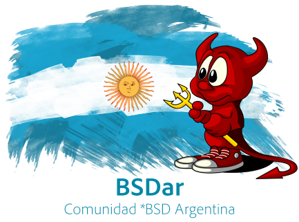

# BSDar - Comunidad *BSD Argentina

BSDar es una comunidad dedicada a la familia de sistemas operativos BSD (FreeBSD, OpenBSD, etc.). Nos reunimos el tercer jueves de cada mes para compartir unas birras, comidas, presentaciones, discusiones y para socializar. El primer encuentro fue el 2019-06-20.

La comunidad está dirigida a toda persona interesada en cualquiera de las variantes de BSD, ya sea para kernel hacking, desarrollo, administración o simplemente para conocer el mundo BSD.

El formato de la meetup es algo intermedio entre una reunión social y un workshop/installfest. Los participantes pueden traer sus equipos para experimentar con *BSD – siempre hay pendrives con liveUSB de FreeBSD y OpenBSD preinstalados.

Nuestro principal medio de comunicación es el canal en Telegram: https://t.me/BSDar.

## Próximo hackaton (next meetup)
* Fecha (date): 2019-10-06
* Hora (time): 12-22hs
* Lugar (place): Paraguay 1896, 7 piso (Av. Cordoba y Av. Callao, est. subte "Callao" línea D; Ciudad Autónoma de Buenos Aires)

## Próximo meetup (next meetup)
* Fecha (date): 2019-10-17
* Hora (time): 19-01hs
* Lugar (place): TBA

## BSDar en eventos externos (BSDar at external events)
* 2019-09-27: [Workshop](man/workshops/eko15) at Ekoparty #15
* 2019-06-12: [Stand](events/20190612_buzzconf.md) at BuzzConf

## Reuniones anteriores (previous meetups)
* El 3er meetup (2019-08-15 en Casa Malta): [detalles](meetups/20190815.md), [meetup info](https://www.meetup.com/sysarmy/events/263950117/)
* El 2do meetup (2019-07-18 en Casa Malta): [detalles](meetups/20190718.md), [meetup info](https://www.meetup.com/sysarmy/events/263198844/)
* El 1r almuerzo (2019-06-26 en la parrilla Makarios): [detalles](meetups/20190626.md)
* El 1r meetup (2019-06-20 en Casa Malta): [detalles](meetups/20190620.md), [meetup info](https://www.meetup.com/sysarmy/events/262444553/)

## Reuniones del comité organizador (the organizational committee meetings)
* 2da reunión (2019-09-02 en Paraguay 1896): [detalles](org/20190902.md)
* 1ra reunión (2019-08-27 en Av. L. N. Alem 826): [detalles](org/20190827.md)

  

  

