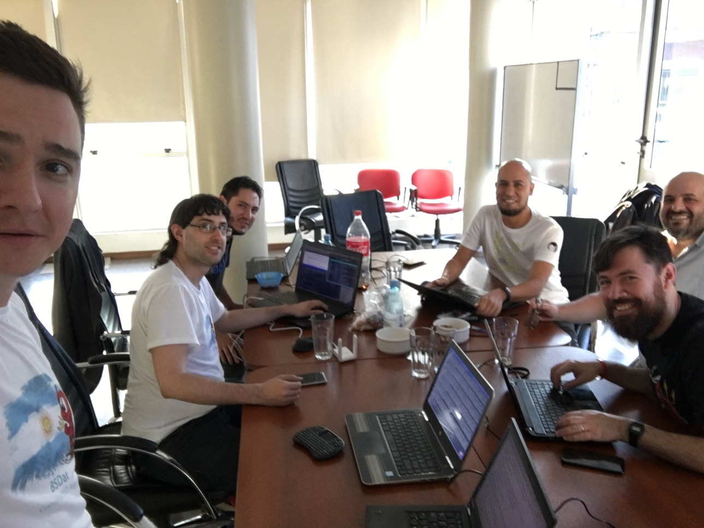
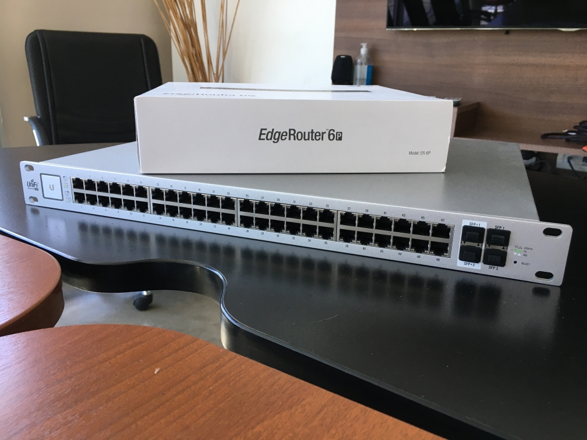
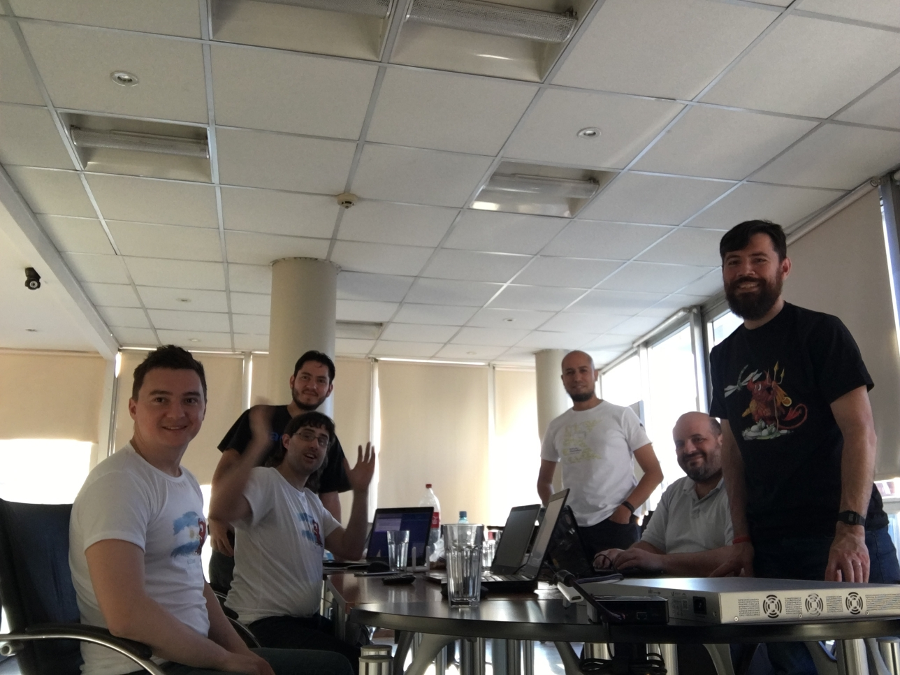
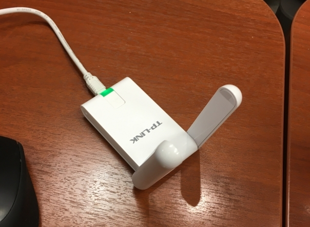
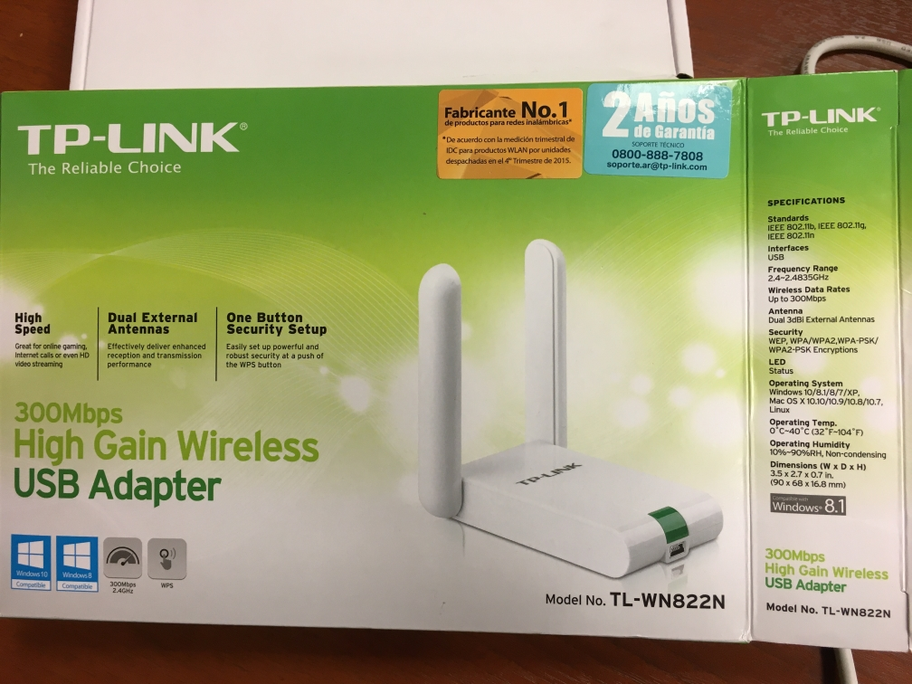
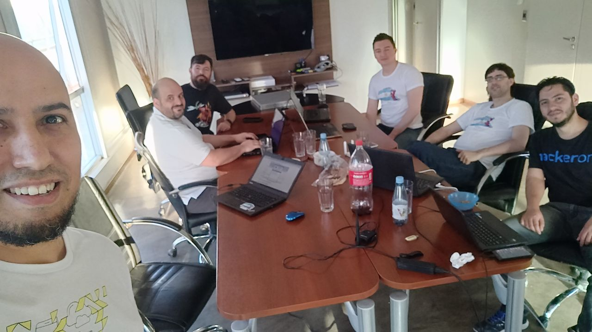

# Hackaton #1!

## Detalles
* Fecha (date): 2019-10-06
* Hora (time): 12-22hs
* Lugar (place): Paraguay 1896 (Buenos Aires)

En este primer hackaton vimos cómo compilar kernel de OpenBSD y de paso aprovechamos la oportunidad para implementar el soporte de la V4 de TPLINK TL-WN822N WiFi USB Adapter (agregamos un nuevo product ID al urtwn driver).

